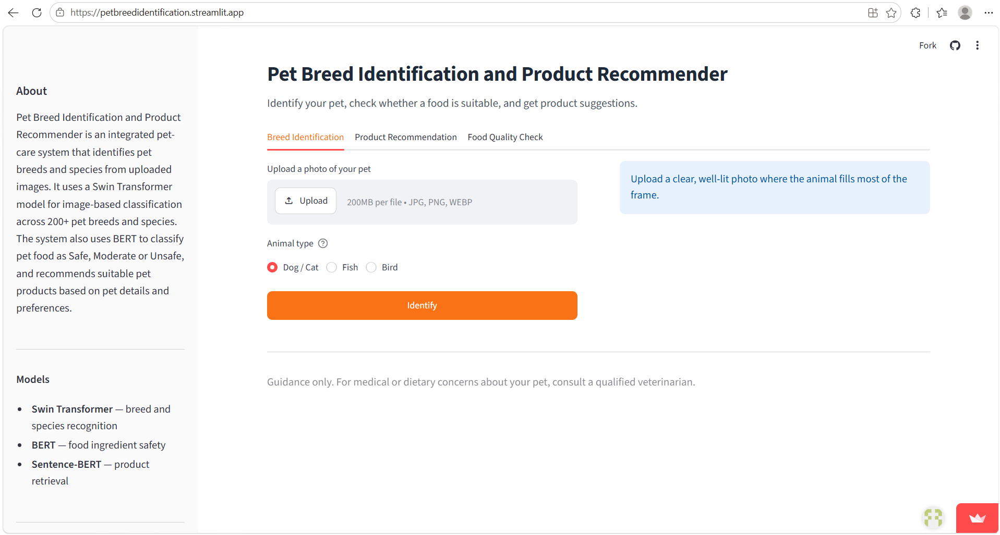

# Pet Breed Identification and Product Recommender

An integrated pet-care system that identifies pet breeds, checks food quality, and recommends suitable pet products.

**Live app:** [petbreedidentification.streamlit.app](https://petbreedidentification.streamlit.app/)

## Preview

## 1. Project Overview

The system helps pet owners make better care decisions by:

- Identifying pet breeds/species from images
- Checking whether pet food is **Safe, Moderate, or Unsafe**
- Recommending suitable pet products
- Providing an interactive Streamlit web interface

The system supports **Dog, Cat, Fish, Bird** classification.

## 2. Technologies Used

- Python
- PyTorch
- Torchvision
- Swin Transformer
- BERT
- Sentence Transformers
- Streamlit
- Google Colab GPU (training)
- Streamlit Community Cloud (deployment)

## 3. Models

### Swin Transformer

Used for image-based pet breed/species identification.

**Model:**

~~~text
swin_tiny_patch4_window7_224
~~~

### BERT

Used to analyze pet food ingredient information and classify it as:

**Safe | Moderate | Unsafe**

### Sentence Transformers

Used for semantic similarity-based product recommendation.

## 4. Datasets

- **Oxford-IIIT Pet Dataset** – Dog and Cat breeds
- **Stanford Dogs Dataset** – Dog breeds
- **CUB-200-2011** – Bird species
- **Fish Dataset** – Fish classification
- **Pet Food Dataset** – Food ingredient analysis
- **Pet Product Dataset** – Product recommendations

## 5. Application Modules

### Breed Identification

Upload an image, select the animal type, and receive the predicted breed/species with a confidence score.

### Food Quality Check

Enter food ingredients and receive a classification:

**Safe / Moderate / Unsafe**

### Product Recommendation

Enter pet details such as type, breed, size, age, and weight to receive suitable product suggestions.

The three modules are integrated into a single Streamlit interface as separate tabs.

## 6. Results

| Module | Accuracy |
|---|---:|
| Breed Identification | **89.25%** |
| Food Quality Check | **66.67%** |
| Product Recommendation | **79.17%** |

The breed identification module achieved **89.25% accuracy across 151 classes**.

> The accuracy values represent separate modules and should not be combined into a single overall project accuracy.

## 7. System Workflow

~~~text
                         PET CARE SYSTEM
                                |
          +---------------------+---------------------+
          |                     |                     |
          v                     v                     v
   Breed Identification    Food Quality Check   Product Recommendation
          |                     |                     |
          v                     v                     v
   Image Processing        Text Processing      Pet Information
          |                     |                     |
          v                     v                     v
   Swin Transformer             BERT          Sentence Transformers
          |                     |                     |
          v                     v                     v
   Breed/Species          Safe/Moderate/        Recommended
    Prediction               Unsafe              Products
~~~

## 8. How It Works

### Breed Identification

1. The user uploads a pet image.
2. The user selects the animal type.
3. The image is resized to **224 × 224** pixels.
4. The image is converted into a tensor and normalized.
5. The appropriate Swin Transformer model processes the image.
6. The predicted breed/species and confidence score are displayed.

### Food Quality Check

1. The user selects the pet type and category.
2. The user enters food or ingredient information.
3. The information is checked against the reference dataset, and unmatched
   entries are classified using the BERT-based model.
4. The system returns:
   - **Safe**
   - **Moderate**
   - **Unsafe**

### Product Recommendation

1. The user enters pet details such as:
   - Pet type
   - Breed
   - Size
   - Age
   - Weight
2. Product information is encoded using Sentence Transformers.
3. Cosine similarity is used to identify relevant products.
4. Suitable products are displayed with product images.

## 9. Project Structure

~~~text
Pet-breed-identification-and-product-recommender/
│
├── app.py                      # Streamlit application
├── requirements.txt
├── README.md
├── preview.png
├── check_files.py              # verifies all required files are present
│
├── final_pet_model.pth         # Swin Transformer – dog/cat (151 classes)
├── fish_model.pth              # Swin Transformer – fish (118 classes)
├── bird_model.pth              # Swin Transformer – bird (200 classes)
├── classes.json
├── fish_classes.json
├── bird_classes.json
│
├── food_bert_model/            # fine-tuned BERT for food classification
│
├── pet_food_dataset.csv
├── pet_products.csv
│
└── productimages/
    ├── product_image_1
    ├── product_image_2
    └── ...
~~~

## 10. How to Run

### Using the Live App

Open [petbreedidentification.streamlit.app](https://petbreedidentification.streamlit.app/) in any browser. No installation required.

### Running Locally

Clone the repository:

~~~bash
git clone https://github.com/ArthiKontham/Pet-breed-identification-and-product-recommender.git
~~~

Navigate to the project directory:

~~~bash
cd Pet-breed-identification-and-product-recommender
~~~

Install the required dependencies:

~~~bash
pip install -r requirements.txt
~~~

Run the application:

~~~bash
streamlit run app.py
~~~

The Streamlit interface opens automatically at `http://localhost:8501`.

### Using Google Colab

Open the notebook in Google Colab and run the cells in order to reproduce dataset preparation, training and evaluation.

## 11. Deployment

The application is deployed on **Streamlit Community Cloud**, which builds
directly from this GitHub repository.

## 12. Model Files

The application requires the trained model files and class mappings:

~~~text
final_pet_model.pth
fish_model.pth
bird_model.pth
classes.json
fish_classes.json
bird_classes.json
food_bert_model/
~~~

Large model files are tracked with **Git LFS**. They can alternatively be hosted
on an external model-hosting service and downloaded at runtime.

`check_files.py` can be run before deployment to confirm that every required
file is present and correctly named:

~~~bash
python check_files.py
~~~

## 13. Notebook

The notebook contains the complete project workflow, including:

- Dataset preparation
- Dataset merging
- Image preprocessing
- Model training
- Model evaluation
- Breed prediction
- Food quality classification
- Product recommendation

## 14. Objectives

- Identify pet breeds from images.
- Check pet food quality.
- Recommend suitable pet products.
- Integrate multiple pet-care features into a single system.
- Provide a simple and interactive user interface.
- Deploy the system as a publicly accessible web application.

## 15. Future Improvements

- Increase dataset size and diversity.
- Improve model accuracy.
- Add real-time camera-based identification.
- Develop a mobile application.
- Improve personalized product recommendations.
- Add pet health monitoring.
- Add diet planning and nutritional recommendations.
- Add multilingual support.
- Integrate veterinary consultation features.

## Project Summary

**Pet Breed Identification and Product Recommender** is an integrated pet-care
system that combines image classification, food quality checking, and product
recommendation. It identifies pet breeds/species from images, classifies pet
food as Safe, Moderate, or Unsafe, and recommends suitable pet products through
an interactive Streamlit interface, deployed publicly on Streamlit Community
Cloud.
